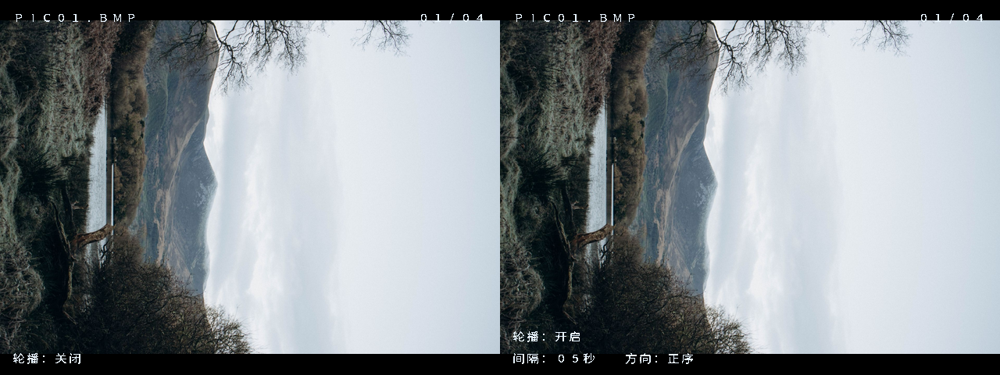

# 君神开播了

# 安路 FPGA TF 卡图片播放器

基于康芯 HX4S20 开发板（安路 EG4S20BG256）的图片播放器，使用 TF 卡读取 BMP，经 SDRAM 帧缓存输出到 HDMI。

## 已实现功能

- FAT32 根目录自动扫描，支持任意文件名及大小写 BMP 扩展名，最多播放前 32 张有效图片。
- 支持目录、图片的碎片化 FAT 簇链；跳过不支持的 BMP 头部，出现读卡异常时显示中文提示。
- KEY2/KEY3 双向切图；KEY4 开关轮播；SW1/SW2 选择 2/5/10/20 秒间隔；SW3 选择正序或倒序。
- 黑色背景的十二点加载动画，照片在完整帧边界切换。
- 透明悬浮文字：左上角文件名、右上角序号/总数、左下角轮播状态；仅开启轮播时显示间隔和方向，正常提示约 2 秒后隐藏。
- 八位数码管显示 `01 OF 04`，每次按键蜂鸣提示。
- 冷启动等待及失败重试，两个 HDMI 接口输出相同画面。

HDMI 当前输出图片和加载动画。音频播放与视频文件解码尚未实现，蜂鸣器用于按键提示。



上图从中文 OSD 的 RTL 仿真采集：左图关闭轮播，仅显示状态；右图开启轮播，多显示一行间隔和方向，图片背景透过文字空白。

## 目录

```text
constraints/   引脚和时钟约束
rtl/           自编写逻辑、内置字库及板卡参考底层模块
prj/           TD 工程、PLL IP 和编译脚本
sim/           文件解析、按键、数码管和中文界面仿真
media/         可直接写入 TF 卡的四张 BMP、原图及来源记录
tools/         内置中文点阵字库生成工具
release/       最新 TF_IMAGE.bit
docs/          使用说明、修正记录、验证摘要及第三方字体声明
```

## 使用方法

TF 卡格式为 FAT32，将 `media/PIC01.BMP` 至 `PIC04.BMP` 放在根目录。也可以使用自己的图片：必须是 **640×480、24 位 RGB、无压缩 BI_RGB、正高度 BMP**。程序按目录项顺序播放，不按文件名排序，最多收录前 32 张有效图片。

开发板断电插卡，上电后使用 BitWriter 添加 `release/TF_IMAGE.bit`，选择 **AL-LINK、PROGRAM_SRAM、1MHz** 下载。确认画面正常后可使用 **PROGRAM_FLASH、1MHz** 固化同一文件。

| 控件 | 功能 |
|---|---|
| KEY1 | 复位到第一张，并停止轮播 |
| KEY2 / KEY3 | 下一张 / 上一张，加载时忽略切图 |
| KEY4 | 启动 / 停止自动轮播 |
| SW1 / SW2 | 间隔：下下 2 秒；SW1 上 5 秒；SW2 上 10 秒；都上 20 秒 |
| SW3 | 下：正序；上：倒序 |
| SW5 | 下：接通按键蜂鸣器 |
| SW6 | 上：选择数码管 |

显示间隔从照片真正显示后开始计时，加载期间暂停。KEY2/KEY3 手动切图不会关闭已开启的轮播。图片文件的目录顺序、具体错误及重试行为见 [自动扫描与屏幕提示](docs/自动扫描与屏幕提示.md)。

## 编译

在 TD 中打开 `prj/TF_IMAGE.al`，顶层为 `tf_image_top`。工程文件使用相对源码路径；生成的中文字库已包含在源码中，无需安装字体或 Python 库。

Linux 命令行编译：

```bash
TD_BIN=/你的TD安装目录/bin/td.sh bash prj/build_tf_image.sh
```

本项目必须使用 **TD 6.2.1（Build 175876）**，设备 EG4S20BG256，编译需要已安装的 TD 工具及许可证。脚本优先使用 `TD_BIN`，其次使用 `~/.local/opt/TD_6.2.1_Release_175876_NL/bin/td.sh`，最后查找 PATH 中的 `td.sh`。脚本会拒绝其他 TD 版本，并检查是否生成本次编译的新 bit 文件及最终建立/保持时序是否通过。

编译生成 `prj/TF_IMAGE_Runs/phy_1/TF_IMAGE.bit`。验证时序后可复制到 `release/TF_IMAGE.bit`；编译中间目录与日志已在 `.gitignore` 中排除。

## 仿真

需要 Python 3 及 Icarus Verilog（iverilog/vvp）。这些测试使用合成扇区与逻辑握手，不模拟真实 SPI、SDRAM芯片或显示器。

```bash
bash sim/run_catalog_tests.sh
bash sim/run_ui_tests.sh
bash sim/run_loader_tests.sh
```

文件名当前显示 FAT 8.3 短名；长文件名显示其短名别名，详见 [中文界面说明](docs/中文界面说明.md)。

可选字库重建需要 Pillow 和 Noto Sans CJK SC。详细流程见 [中文界面说明](docs/中文界面说明.md)，字体声明见 [第三方来源说明](THIRD_PARTY_NOTICES.md)。

## 验证记录

最新中文界面、字体像素、提示时长、错误持续显示和一拍字库输出对齐已通过仿真；动态总数按键、轮播、数码管测试通过。自动目录扫描和 307200 像素读取的验证结果见 [验证记录](docs/验证记录.md)。最新 bit 已完成布局布线与时序检查，实板中文显示需下载后确认。
